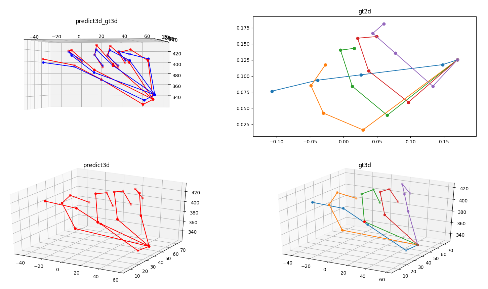
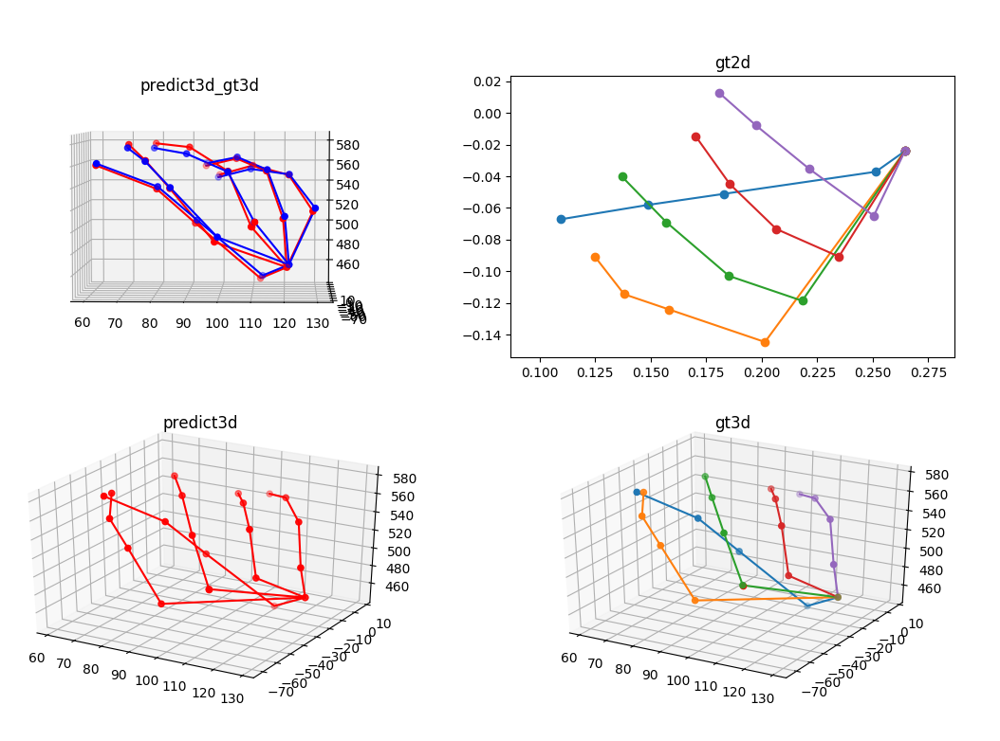
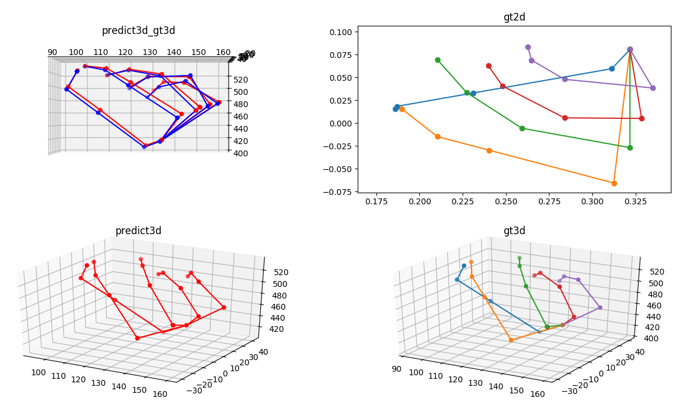
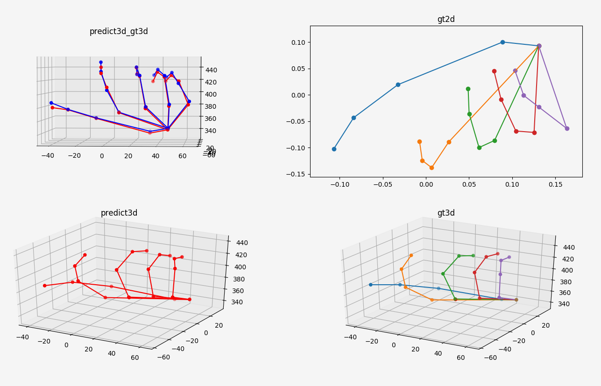

# hand2dTo3d


- Support for onnx test.

## Tested the environment that works
- Ubuntu16.04
- Python3.7
- onnxruntime1.2

## 

```Python
python test2d_3d.py
```



##  Reference
- [3d_pose_baseline_pytorch](https://github.com/weigq/3d_pose_baseline_pytorch.git)

@inproceedings{FirstPersonAction_CVPR2018,
  title={First-Person Hand Action Benchmark with RGB-D Videos and 3D Hand Pose Annotations},
  author={Garcia-Hernando, Guillermo and Yuan, Shanxin and Baek, Seungryul and Kim, Tae-Kyun}
  booktitle = {Proceedings of Computer Vision and Pattern Recognition ({CVPR})},
  year = {2018}
}
